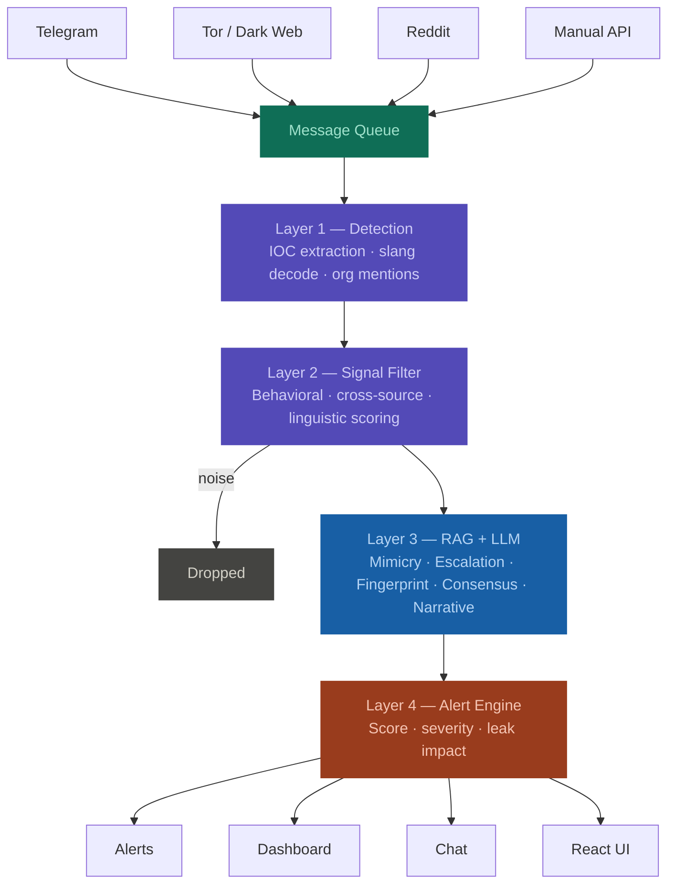

# ShadowEcho — Backend

AI-powered dark web threat intelligence platform. Monitors underground forums, Telegram channels, and Tor sites, runs posts through a multi-layer detection and analysis pipeline, and surfaces actionable alerts for security analysts.

All inference runs locally via Ollama. No data is sent to external APIs.

---

## Table of contents

- [Architecture](#architecture)
- [Models](#models)
- [Requirements](#requirements)
- [Installation](#installation)
- [API endpoints](#api-endpoints)
- [Project structure](#project-structure)
- [Data pipeline](#data-pipeline)
- [Monitoring](#monitoring)
- [Running tests](#running-tests)
- [Environment variables](#environment-variables)

---

## Architecture



### Pipeline layers

| Layer | Name | What it does |
|---|---|---|
| 1 | Detection | Keyword matching, IOC extraction, slang decoding, org mention detection. Produces a detection score. |
| 2 | Signal filter | Four behavioral scoring layers — behavioral heuristics, cross-source correlation, linguistic deception, coordination detection. Posts below threshold are dropped as noise. |
| 3 | RAG + LLM | Retrieves similar historical posts from ChromaDB. Feeds everything into `llama3.1:8b` for a single call producing 5 intelligence module outputs. |
| 4 | Alert engine | Combines all module outputs into a final alert score, determines severity, fires alerts. Leak Impact Estimator runs in parallel without an LLM call. |

### 5 intelligence modules (Layer 3)

| Module | Output |
|---|---|
| Mimicry | Is the actor genuine or trolling/scamming? |
| Escalation | Threat stage on a 1–5 scale |
| Fingerprint | Behavioral actor profile — writing style, experience level, actor ID |
| Consensus | Solo actor vs organized group, momentum |
| Narrative | Summary, threat type, timeline, targets, recommended actions |

---

## Models

| Model | Purpose | Served via |
|---|---|---|
| `llama3.1:8b` | Pipeline intelligence — 5-module structured JSON output | Ollama |
| `llama3.2:3b` | Analyst chatbot — conversational Q&A | Ollama |
| `bge-m3:567m` | Text embeddings for RAG | Ollama |

---

## Requirements

- Python 3.11+
- [Ollama](https://ollama.com) running locally on port 11434
- Windows, Linux, or macOS

---

## Installation

**1. Clone and navigate to the backend directory**

```bash
cd shadowecho-backend
```

**2. Create and activate a virtual environment**

```bash
python -m venv .venv

# Windows
.venv\Scripts\activate

# Linux / macOS
source .venv/bin/activate
```

**3. Install dependencies**

```bash
pip install -r requirements.txt
```

**4. Pull required Ollama models**

```bash
ollama pull llama3.1:8b
ollama pull llama3.2:3b
ollama pull bge-m3:567m
```

**5. Create the environment file**

Create a `.env` file in the backend root:

```env
# Telegram (optional — required for live scraping)
TELEGRAM_API_ID=your_api_id
TELEGRAM_API_HASH=your_api_hash
TELEGRAM_CHANNELS=t.me/channel1,t.me/channel2

# Reddit (optional — required for live scraping)
REDDIT_CLIENT_ID=your_client_id
REDDIT_CLIENT_SECRET=your_client_secret
REDDIT_USER_AGENT=ShadowEcho/1.0

# Optional overrides
OLLAMA_BASE_URL=http://localhost:11434
API_HOST=0.0.0.0
API_PORT=8000
```

**6. Initialize the database and load data**

```bash
# Initialize SQLite schema
python -c "from db.database import init_db; init_db()"

# Load processed posts into ChromaDB (builds vector index)
python data/chroma_loader.py

# Sync posts into SQLite so the dashboard shows data
python sync_sqlite.py
```

**7. Start the server**

```bash
uvicorn main:app --host 0.0.0.0 --port 8000 --reload
```

API available at `http://localhost:8000`
Interactive docs at `http://localhost:8000/docs`

---

## API endpoints

| Method | Endpoint | Description |
|---|---|---|
| `GET` | `/` | System info and version |
| `GET` | `/health` | Database and Ollama status |
| `GET` | `/metrics` | Prometheus metrics scrape endpoint |
| `GET` | `/api/dashboard` | Aggregated stats, recent alerts, recent signals |
| `POST` | `/api/dashboard/analyze` | Run a post through the full pipeline |
| `GET` | `/api/alerts` | List alerts with optional severity filter |
| `GET` | `/api/alerts/summary` | Alert counts by severity |
| `POST` | `/api/alerts/acknowledge` | Acknowledge an alert |
| `POST` | `/api/mirror` | Org mention search and actor profile |
| `POST` | `/api/lineup` | Cluster similar posts by threat actor |
| `GET` | `/api/impact/methodology` | Leak impact estimation methodology |
| `POST` | `/api/impact` | Estimate breach impact for a post |
| `POST` | `/api/chat` | Analyst chatbot (RAG-grounded) |
| `POST` | `/api/chat/stream` | Streaming chatbot via SSE |
| `POST` | `/api/feedback` | Submit analyst label on a post |
| `GET` | `/api/feedback/stats` | Feedback label distribution |

---

## Project structure

```
shadowecho-backend/
├── main.py                        Application entry point, FastAPI app, background tasks
├── config.py                      All configuration — paths, model names, thresholds
├── sync_sqlite.py                 Utility to sync JSON posts into SQLite
│
├── api/
│   ├── routes/
│   │   ├── dashboard.py           Main analysis endpoint
│   │   ├── alerts.py              Alert management
│   │   ├── mirror.py              Org profile and mention tracking
│   │   ├── lineup.py              Threat actor clustering
│   │   ├── chat.py                Analyst chatbot
│   │   └── feedback.py            Analyst labeling
│   └── schemas.py                 Pydantic request and response models
│
├── core/
│   ├── detector.py                Layer 1 — IOC extraction, keyword matching, slang decode
│   ├── signal_filter.py           Layer 2 — four behavioral scoring layers
│   ├── rag.py                     ChromaDB similarity search and LLM input builder
│   ├── llm.py                     Ollama LLM interface for pipeline and chatbot
│   ├── alert_engine.py            Layer 4 — alert scoring and severity
│   └── embeddings.py              ChromaDB read/write wrapper
│
├── modules/
│   ├── mimicry.py                 Mimicry module output parser
│   ├── escalation.py              Escalation module output parser
│   ├── fingerprint.py             Fingerprint module output parser
│   ├── consensus.py               Consensus module output parser
│   ├── narrative.py               Narrative module output parser
│   ├── leak_impact.py             Standalone leak impact estimator (no LLM)
│   └── slang_decoder.py           Dark web coded language decoder
│
├── db/
│   ├── database.py                SQLite connection and schema initialization
│   ├── crud.py                    All database read/write operations
│   └── models.py                  Model definitions
│
├── stream/
│   ├── telegram_listener.py       Async Telegram listener, shared message queue
│   └── tor_crawler.py             Periodic Tor forum crawler
│
├── data/
│   ├── process_raw.py             Normalize raw scraper output to unified schema
│   ├── chroma_loader.py           Load posts into ChromaDB with bge-m3 embeddings
│   └── scrapers/
│       ├── telegram_scraper.py    Bulk historical Telegram scraper
│       ├── reddit_scraper.py      Reddit subreddit scraper
│       └── tor_scraper.py         Tor forum scraper via SOCKS5 proxy
│
├── monitoring/
│   ├── metrics.py                 Prometheus metric definitions
│   └── middleware.py              HTTP request tracking middleware
│
├── prompts/
│   └── master_prompt.txt          LLM prompt template for the 5-module pipeline
│
├── vectorstore/chroma_db/         ChromaDB persistent storage
└── db/shadowecho.db               SQLite database
```

---

## Data pipeline

If setting up from scratch with raw scraper data:

```bash
# Step 1 — scrape sources (configure targets in each scraper first)
python data/scrapers/reddit_scraper.py
python data/scrapers/telegram_scraper.py
python data/scrapers/tor_scraper.py

# Step 2 — normalize all raw data into unified schema
python data/process_raw.py

# Step 3 — embed and load into ChromaDB
python data/chroma_loader.py

# Step 4 — sync to SQLite for the dashboard
python sync_sqlite.py
```

If you already have a processed `all_posts.json`, start from step 3.

---

## Monitoring

Prometheus and Grafana via Docker Compose:

```bash
docker-compose -f docker-compose.monitoring.yml up -d
```

| Service | URL | Credentials |
|---|---|---|
| Prometheus | `http://localhost:9090` | — |
| Grafana | `http://localhost:3000` | admin / shadowecho |

The Grafana dashboard is auto-provisioned and tracks pipeline latency by stage, alert rates by severity, LLM call durations, signal-to-noise ratio, slang decode counts, ChromaDB document count, and HTTP metrics.

---

## Running tests

```bash
python test_detector.py
python test_signal_filter.py
python test_alert_engine.py
python test_leak_impact.py
python test_rag.py
python test_api.py
```

---

## Environment variables

| Variable | Default | Description |
|---|---|---|
| `OLLAMA_BASE_URL` | `http://localhost:11434` | Ollama server URL |
| `OLLAMA_MODEL` | `llama3.1:8b` | Pipeline LLM model |
| `TELEGRAM_API_ID` | — | Telegram API credentials |
| `TELEGRAM_API_HASH` | — | Telegram API credentials |
| `TELEGRAM_CHANNELS` | — | Comma-separated channel list |
| `REDDIT_CLIENT_ID` | — | Reddit API credentials |
| `REDDIT_CLIENT_SECRET` | — | Reddit API credentials |
| `TOR_SOCKS_PROXY` | `socks5h://127.0.0.1:9050` | Tor SOCKS5 proxy address |
| `API_HOST` | `0.0.0.0` | FastAPI bind address |
| `API_PORT` | `8000` | FastAPI port |
| `ORG_WATCHLIST` | — | Comma-separated org names to monitor |
